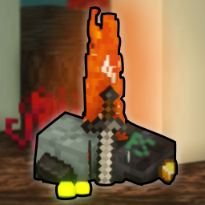

#  **Keep Some Inventory**

**Isn't it annoying when you die and your items are far away and surrounded by danger?**

With this data pack no longer, since you **keep your fighting equipment** like weapons, tools and armor **on you when dying**!

## **Overview**
**Personally I don't like** playing with the `keepInventory` gamerule set to `true` because it feels cheap to go somewhere dangerous **without the risk** of losing anything.
This data pack aims to give dangerous areas their **risk back** while still allowing you to **use your best equipment** that you spent hours on farming, crafting and enchanting.

## **Features**
When dying, you **keep all your equipment** on you while still **dropping your resources**.

<details><summary>You will <b>keep these items</b>: &nbsp; ( 🠋 )</summary>
<li><b>Armor</b>, <b>Elytra</b>, Heads, Skulls and Carved Pumpkins
<li><b>Tools</b> and <b>Weapons</b> including Trident, Flint and Steal and Fishing Rods
<li>Clocks, Compasses and <b>Recovery Compasses</b>
<li>All Golden Apples, Potions and Totems
<li>Every type of Arrow and Firework Rockets
<li>Ender Pearls and Ender Eyes
<li>Goat Horns, Spyglasses, all Maps and all Buckets
<li>All types of Boats, Minecarts, Saddles and Horse Armor
<li>Written Books and Writable Books (Book and Quill) 
<li>Carrots on a Stick and Warped Fungi on a Stick
</details><br>

Your items **will not splatter**, they all stay at the exact location you died at, **no items flying into lava or off of cliffs**.

At the location of your death you can collect **all your experience** and it is **not limited** to about 7 levels, like in vanilla minecraft.

After dying, your **items will despawn after 10 minutes** instead of despawning after the normal 5 minutes.<br>
➔ _the time items take to despawn can be modifed using the [config](#configure-the-pack)_

## **Configure the Pack**
If you are an admin or have cheats enabled, you can easily **configure the data pack's behavior** by running the following command:
```mcfunction
function ps-keep:config
```
That will **open this menu in the chat**:


You can then **change the values by clicking on the text**.
- `Item despawn offset`, is the **time removed** from the default 5 minutes **despawn timer** in ticks
    - The default is `-6000` ticks, with this you get **5 minutes extra**, so your items despawn after 10 minutes
    - Setting it to `5999` will mean, that they despawn after just a **single tick**
    - If you set it to `-32768`, items after death will stay for **over 32 minutes**
- `Keep Experience` determines **if experience will drop**
    - If the setting is at it's default `0`, you will **drop all** of your experience where you died
    - When it is set to `1`, you **keep all** your experience with you, like how the `keepInventory` gamerule works
- `Keep Items` determines what items will drop
    - If the setting is at it's default `1`, you **only drop resources but no equipment**<br>
    _(you can see all items that are kept [here](#features))_
    - You will **drop all your items** by setting it to `0`, but keeping the **experience**, that items **don't splatter** and the **item despawn time** will still apply as expected
    - If the setting is set to `2`, you will **keep all your items** while still being able to drop your experience

If you want to **adjust what items you keep or drop on death**, you can **modify** the `drop_on_death` item tag at `/data/ps-keep/tags/items/drop_on_death.json`.<br>
All the items listed in this tag **will be dropped on death**, so if you want to **keep a specific item**, that you normally drop, just **remove it's entry** from this list.

When **building the data pack from source**, you can easily adjust the items by modifying the [`drop_on_death.bolt`](src/data/ps-keep/modules/drop_on_death.bolt) file.

---
Check me out on other platforms:

[](https://modrinth.com/user/PuckiSilver)
[](https://www.planetminecraft.com/member/puckisilver)
